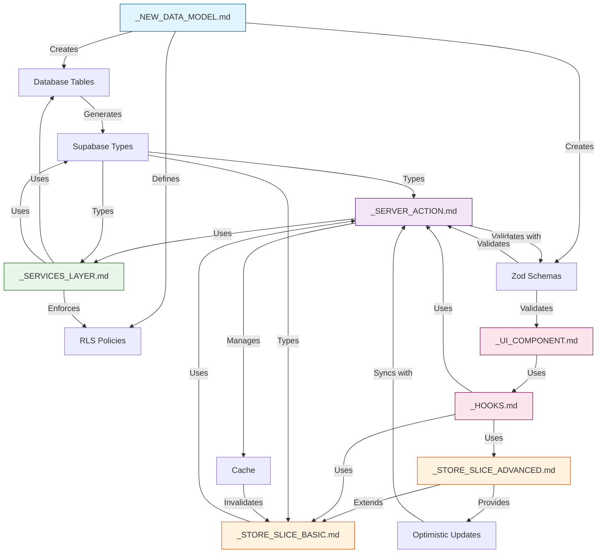

# Feature Implementation Tree

## Context for AI Agent
This visualization shows the complete implementation tree for a feature in the Next.js/Supabase/Zustand stack, following a backend-first approach. It illustrates all dependencies, connections, and data flows between different templates and components.

## Implementation Tree

## Layer Color Guide
- 🔵 Blue: Data Foundation Layer
  - Database schema
  - RLS policies
  - Type generation
  - Validation schemas

- 🟢 Green: Data Access Layer
  - Database operations
  - Query optimization
  - Error handling

- 🟣 Purple: Server Integration Layer
  - Server actions
  - Cache management
  - API endpoints

- 🟡 Orange: Client State Layer
  - Basic state management
  - Advanced state patterns
  - Optimistic updates

- 🔴 Pink: UI Layer
  - Custom hooks
  - Components
  - User interactions

## Key Flows

### Type Flow
1. Database schema generates Supabase types
2. Types are used by services and actions
3. Actions provide types to stores
4. Stores provide types to UI

### Data Flow
1. UI triggers actions
2. Actions call services
3. Services interact with database
4. Results flow back up through layers

### Validation Flow
1. Zod schemas defined at data layer
2. Used by server actions for input
3. Used by UI for form validation
4. Ensures consistent validation
